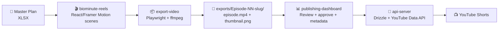

# BioMinute Shorts Studio 🎬

> AI-powered health-science YouTube Shorts production pipeline — from master plan spreadsheet to published video, fully automated.

[](VERSION.md)
[](LICENSE)
[](https://nodejs.org)
[](https://www.typescriptlang.org)
[](https://pnpm.io)
[](https://react.dev)
[](https://github.com/0utLawzz)
[](https://github.com/0utLawzz/biominute-shorts-studio)

## Topics / Keywords
`biominute` `youtube-shorts` `health` `ai-pipeline` `react` `typescript` `pnpm` `video-production` `automation` `custom-automation`

## What is this?
**BioMinute Shorts Studio** is a monorepo production system for the **BioMinute** health channel — a YouTube Shorts series delivering 60-second, science-backed health insights. Full episode lifecycle from spreadsheet master plan → animated video → publish.

See the full architecture, pipeline, commands, and documentation in the sections below and in the `docs/` folder.

## Author
**Nadeem (OutLawZ)**  
Custom Automation Specialist  

📧 Contact: [net2outlawzz@gmail.com](mailto:net2outlawzz@gmail.com)  
🔗 GitHub: [0utLawzz](https://github.com/0utLawzz)

---

*Need custom YouTube Shorts / content production automation? Contact me.*

---

## Pipeline Flow



## Quick Start
```bash
pnpm install
pnpm --filter @workspace/db push-force
pnpm --filter @workspace/scripts exec tsx ./src/seed-episodes.ts
# Start api-server, publishing-dashboard, biominute-reels in separate terminals
```

Full docs: [`docs/INSTALL.md`](docs/INSTALL.md) · [`docs/RUN.md`](docs/RUN.md) · [`docs/USAGE.md`](docs/USAGE.md)

## License
MIT © BioMinute Studio / Nadeem (OutLawZ)
